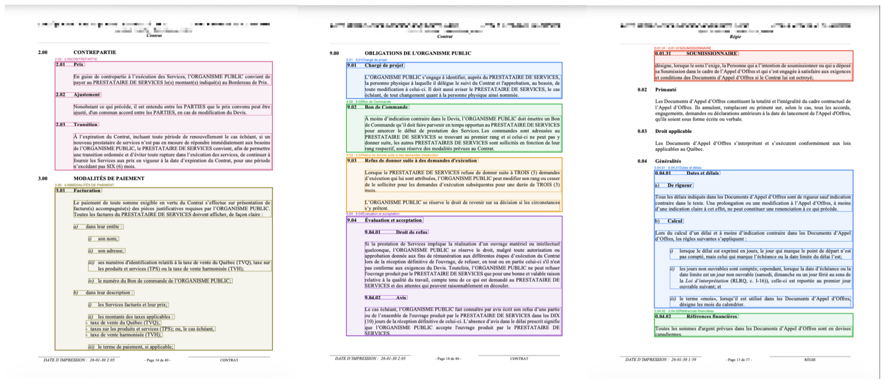

# ContractParser

A Python pipeline that turns a PDF contract into a **structured, hierarchical, RAG-ready** representation. It extracts text and layout from the PDF, rebuilds the document's section tree (numbered hierarchy such as `1.00 → 1.01 → 1.01.01`), splits the text into section-aware chunks, and renders visual overlays so the result can be checked at a glance.


<p align="center">
  
</p>
<p align="center"><em>Output of <code>highlight_chunks()</code>: every section of the contract is wrapped in a colored rectangle (one color per chunk) and labeled with its section id / name. Examples of tier 0/1/2 chunks </em></p>

---

## How it works

The full pipeline is orchestrated by [`main.py`](main.py):

```
master.pdf
   │
   ├─[1] read_pdf ................ pymupdf4llm + layout detection + OCR (eng+fra)
   │        └─► out/output.{json,md,txt}        text + classified layout boxes
   │
   ├─[2] build_pdf_visualization  draws a colored box around every detected element
   │        └─► out/master_annotated.pdf
   │
   ├─[3] section-tree processing  merge_boxes → Edilex reclassification → header
   │        │                     recovery across tiers 0–3
   │        └─► out/processed_output.json
   │
   ├─[4] chunkize_contract ....... builds the section hierarchy and chunks the text
   │        └─► out/document_by_tier.pkl        {tier_0, tier_1, tier_2} LangChain Documents
   │
   └─[5] highlight_chunks ........ draws one colored rectangle per chunk (see image above)
            └─► out/master_chunks_{tier_0,tier_1,tier_2}.pdf
```

| Step | Module | What it does |
|------|--------|--------------|
| 1 | [`read_pdf.py`](read_pdf.py) | Reads the PDF with `pymupdf4llm` (layout + OCR) and exports Markdown, plain text, and a JSON of layout **boxes** classified as `section-header`, `text`, `list-item`, `page-header`, `page-footer`, `footnote`. |
| 2 | [`visualize_pdf.py`](visualize_pdf.py) | `build_pdf_visualization()` renders an annotated PDF that outlines each box in a class-specific color, for visual QA of the extraction. |
| 3 | [`general_sections_tree.py`](general_sections_tree.py) | Merges boxes that belong to the same line, reclassifies mis-labeled boxes on Edilex-format pages, then recovers section headers that OCR/layout missed across tiers 0–3. |
| 4 | [`chunkize.py`](chunkize.py) | Parses the numbered hierarchy and slices the document into nested chunks (one set per tier), returned as `langchain_core` `Document` objects. |
| 5 | [`visualize_pdf.py`](visualize_pdf.py) | `highlight_chunks()` draws one colored rectangle per chunk on the original PDF (the illustration above), so the chunking can be inspected page by page. |

### Chunking & hierarchy

Contracts are numbered hierarchically, and the chunker mirrors that structure into three tiers:

| Tier | Example numbering | Meaning |
|------|-------------------|---------|
| `tier_0` | `1.00`, `2.00` | top-level sections |
| `tier_1` | `1.01`, `1.02` | sub-sections |
| `tier_2` | `1.01.01` | sub-sub-sections |

`chunkize_contract()` returns a dict with one list of chunks per tier:

```python
{
    "tier_0": [Document, ...],
    "tier_1": [Document, ...],
    "tier_2": [Document, ...],
}
```

Each `Document` carries section-aware metadata: `chunk_id`, `chunk_name`, `pages`, `parent`, `children`, `content_boxes`, and `textlength`.

### Annotation color legend (step 2)

| Color | Box class |
|-------|-----------|
| 🟩 Green | `section-header` |
| 🟪 Purple | `page-header` / `page-footer` |
| 🟦 Blue | `text` / `list-item` |
| 🟥 Red | unclassified (review needed) |

---

## Requirements

- **Python 3.11+** (developed and tested on Python 3.13)
- Dependencies listed in [`requirements.txt`](requirements.txt):
  - `pymupdf4llm`, `pymupdf-layout`, `PyMuPDF` — PDF parsing, layout detection, OCR
  - `langchain-core` — chunk `Document` model

> Note: layout-based box classification and OCR are provided by the `pymupdf-layout` add-on to `pymupdf4llm`.

## Installation

```bash
git clone https://github.com/<your-username>/ContractParser.git
cd ContractParser

python -m venv .venv
source .venv/bin/activate        # Windows: .venv\Scripts\activate

pip install -r requirements.txt
```

## Usage

1. Place the contract you want to parse at the repository root as **`master.pdf`**
   (or edit the `PDF_PATH` variable in [`main.py`](main.py) to point at your file).
2. Run the full pipeline:

   ```bash
   python main.py
   ```

3. All artifacts are written to the `out/` directory (created automatically).

You can also call the visualizer on its own once the pickle exists:

```python
from visualize_pdf import highlight_chunks

highlight_chunks("master.pdf", tier="tier_1")   # -> out/master_chunks_tier_1.pdf
```

To consume the final chunks in your own code:

```python
import pickle

with open("out/document_by_tier.pkl", "rb") as f:
    document_by_tier = pickle.load(f)

for doc in document_by_tier["tier_1"]:
    print(doc.metadata["chunk_id"], "—", doc.metadata["chunk_name"])
    print(doc.page_content[:200])
```

## Outputs (`out/`)

| File | Description |
|------|-------------|
| `output.json` | Raw extraction: pages, layout boxes, classes, coordinates, text. |
| `output.md` / `output.txt` | Markdown and plain-text renderings of the PDF. |
| `master_annotated.pdf` | Original PDF with colored boxes around every detected element. |
| `processed_output.json` | Extraction after box merging, Edilex reclassification, and header recovery. |
| `document_by_tier.pkl` | Final hierarchical chunks (`tier_0` / `tier_1` / `tier_2`) as LangChain `Document`s. |
| `master_chunks_tier_{0,1,2}.pdf` | Original PDF with one colored rectangle per chunk (as shown above). |
| `*.png` | Images extracted from the PDF. |

> The `out/` directory and the input `master.pdf` are **git-ignored** — every artifact above is regenerated by running `python main.py`, so bring your own PDF.

---

## Project structure

```
ContractParser/
├── main.py                     # pipeline entry point
├── read_pdf.py                 # step 1 — PDF → text + layout JSON
├── visualize_pdf.py            # steps 2 & 5 — annotated PDF + chunk highlighting
├── general_sections_tree.py    # step 3 — box merging, reclassification, header recovery
├── chunkize.py                 # step 4 — hierarchical chunking → LangChain Documents
├── requirements.txt
├── EXAMPLE_CHUNK.png           # README illustration
└── out/                        # generated outputs (git-ignored)
```

## Notes & limitations

- Tuned for hierarchically numbered contracts (e.g. `1.00`, `1.01`, `1.01.01`); documents with very different structures may need the regex/heuristics in [`general_sections_tree.py`](general_sections_tree.py) adjusted.
- OCR is configured for French + English (`ocr_language="eng+fra"`).
- The input filename is hardcoded as `master.pdf` in [`main.py`](main.py); change `PDF_PATH` to parse another file.
